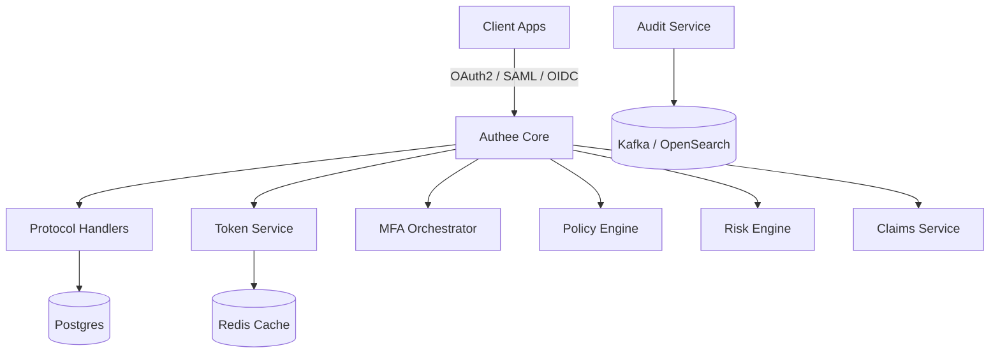
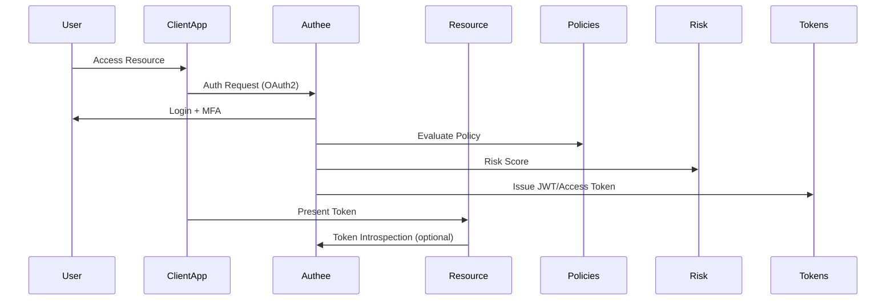

# Authee — Open Identity Engine for Modern Apps.

<p align="center">
  
</p>

> **Authee** — Open Source, Cloud-Native, Policy-Driven Authentication & Authorization Platform.
> Java-first (Spring Boot).

---

## ✨ Why Authee?

* **Open Source First** — transparent, community-driven.
* **Cloud Native** — built for Kubernetes, GitOps, and observability.
* **Policy Aware** — flexible DSL for fine-grained access control.
* **Risk Adaptive** — risk signals integrated into auth decisions.
* **Developer Friendly** — SDKs, CLI, and smooth local dev experience.

---

## 🚀 Features

* OAuth2, OIDC, and SAML support.
* Multi-tenancy with strict isolation.
* Pluggable MFA (WebAuthn, TOTP, Push).
* Risk engine with contextual scoring.
* Fine-grained policy DSL and simulation.
* JWKS endpoint & key rotation.
* Admin APIs + Console.
* Audit events (Kafka/OpenSearch).
* OpenTelemetry-powered observability.

---

## 🏗️ Architecture Overview



### Authentication Flow (OAuth2 Example)



---

## 📂 Repository Structure

```
authee/
├─ authee-core/           # Spring Boot app (exposes API)
├─ authee-protocols/      # OAuth, SAML handlers
├─ authee-policy/         # Policy DSL & evaluator
├─ authee-risk/           # Risk scoring pipeline
├─ authee-tokens/         # JWT, key management
├─ authee-claims/         # Claims mappers
├─ authee-mfa/            # MFA plugins
├─ authee-admin/          # Admin APIs & Console
├─ authee-shared/         # Common utils & models
└─ deploy/                # Docker/K8s manifests
```

---

## 🛠️ Getting Started

### Prerequisites

* Java 21+
* Gradle (wrapper included)
* Docker (for Postgres/Redis)

### Build & Run

```bash
./gradlew build
./gradlew :authee-core:bootRun
```

### Run with Docker

```bash
docker build -t authee:dev -f deploy/Dockerfile .
docker run -p 8080:8080 authee:dev
```

---

## 📊 Observability

* Metrics: Prometheus via Micrometer.
* Traces: OpenTelemetry + Jaeger/Tempo.
* Logs: JSON structured with correlation IDs.

---

## 🤝 Contributing

We welcome contributions! Please check out our [CONTRIBUTING.md](CONTRIBUTING.md).

* Fork the repo & submit PRs.
* Open issues for bugs/feature requests.
* Join community discussions.

---

## 📜 License

Authee is licensed under the **Apache 2.0 License**.

---

## 🙌 Credits

Built with ❤️ by the Authee Engineering team and community contributors.
